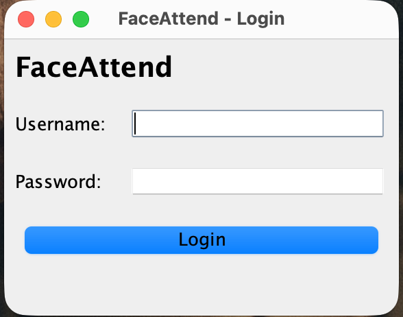
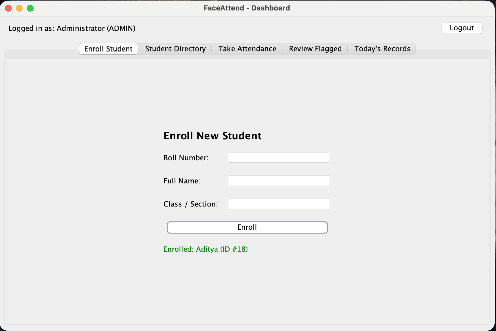
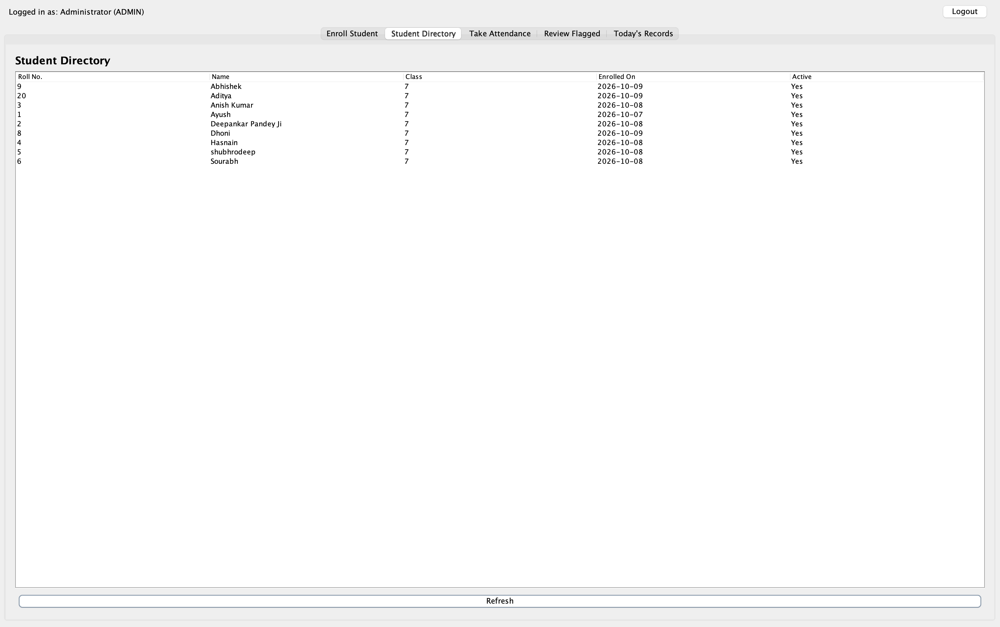
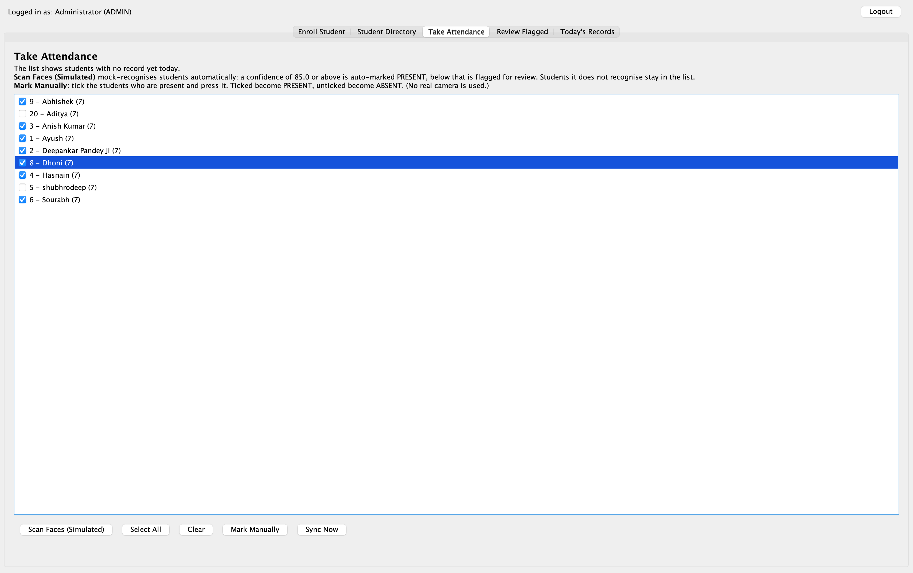
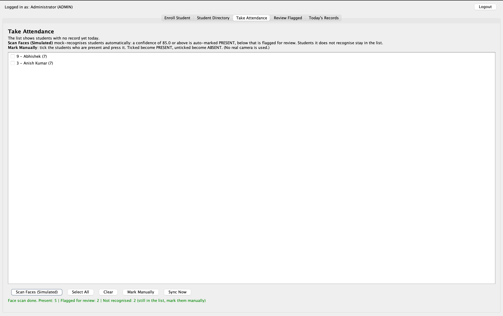
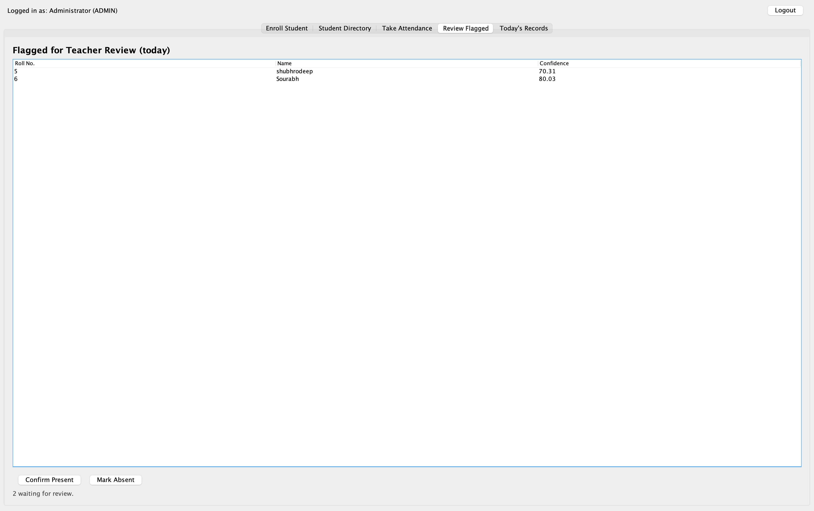
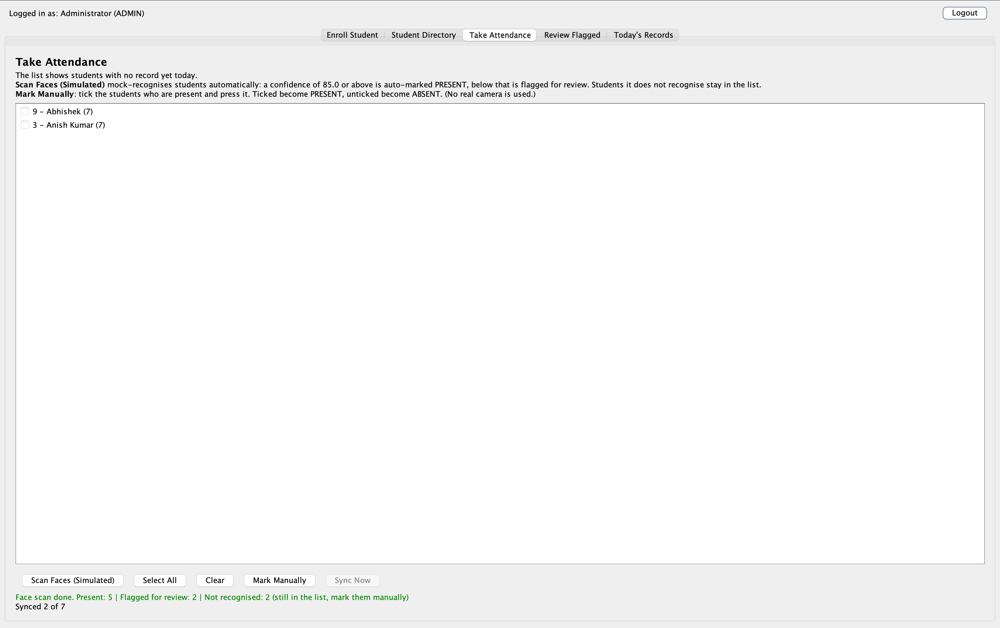

# FaceAttend

A Java desktop app for classroom attendance built around a simulated face-verification workflow.
Students are enrolled once. In each session, every student ticked present gets a simulated
face-match confidence score. High scores are auto-marked PRESENT, low scores are flagged for
manual teacher review. 3rd-semester Java project (Swing + JDBC + MySQL), Galgotias University.

## Features

- Login against a 'users' table, with Logout
- Enroll students (duplicate roll numbers are rejected)
- Student directory
- **Scan Faces (Simulated):** mock-recognises students automatically. A confidence of 85 or above is auto-marked PRESENT, below that is flagged for teacher review, and students it does not recognise stay in the list
- **Mark Manually:** tick the students who are present. Ticked become PRESENT, unticked become ABSENT
- **Review Flagged:** the teacher confirms a flagged entry as Present or marks it Absent
- Today's Records view
- Background sync of attendance records on a separate thread, so the UI never freezes

## Setup

Requirements: JDK 17+, VS Code with the Java extension pack (or any Java IDE), and either Docker or MySQL 8.

### 1. Start MySQL

Docker (what we used):

```bash
docker run --name faceattend-mysql -e MYSQL_ROOT_PASSWORD=YOUR_PASSWORD_HERE -p 3307:3306 -d mysql:8.4
```

Native MySQL works too. It usually listens on port 3306 instead of 3307.

### 2. Create the tables and default users

Docker:

```bash
docker exec -i faceattend-mysql mysql -u root -pYOUR_PASSWORD_HERE < sql/schema.sql
```

Native MySQL:

```bash
mysql -u root -p < sql/schema.sql
```

In Windows PowerShell, `<` is not supported, so use:

```powershell
Get-Content sql/schema.sql | mysql -u root -p
```

`schema.sql` creates the `faceattend` database, its three tables and the three default users.
It is safe to run again, because existing tables and users are left alone.

### 3. Configure the connection

Copy `src/main/resources/db.properties.example` to `src/main/resources/db.properties`
and set your password and port.

### 4. Run

Open the project in VS Code and run `src/main/java/com/faceattend/Main.java`.

If the login screen reports a database error, check that MySQL is running and that
`db.properties` has the right port and password.

## Logins

| Username  | Password     | Role      |
|-----------|--------------|-----------|
| admin     | admin123     | ADMIN     |
| teacher   | teacher123   | TEACHER   |
| inspector | inspector123 | INSPECTOR |

## Project structure

```
src/main/java/com/faceattend/
  model/    Person (abstract), Student, User, AttendanceRecord, Role, AttendanceStatus
  dao/      DAO interfaces and JDBC implementations
  db/       DBConnection
  service/  AttendanceService, EnrollmentService, SyncService
  ui/       LoginFrame, DashboardFrame and the Swing panels
  util/     Custom exceptions
sql/        schema.sql
```

## Java concepts demonstrated

- **OOP:** abstract `Person` extended by `Student` and `User`, DAO interfaces, custom checked exceptions
- **Collections and generics:** `List`, `Set` and `Map` in `AttendanceService`
- **Multithreading and synchronization:** `SyncService` (background thread, synchronized start guard)
- **JDBC:** CRUD with `PreparedStatement` in the DAO classes
- **Transactions:** `AttendanceDAOImpl.markBatch` commits a whole session or rolls it back

## Screenshots

### Login


### Enroll a student


### Student directory


### Take attendance


### Simulated face scan result


### Teacher review of flagged entries


### Background sync


### Data stored in MySQL (after the teacher's review)


## Known limitations

- Face matching is simulated. There is no camera or ML model, and the confidence score is generated by `AttendanceService.simulateConfidence()`.
- Passwords are stored and compared as plain text. Hashing (for example BCrypt) is the production fix.
- Roles are stored on each user, but every role sees the same screens for now.


## Team

Ayush Ranjan, Deepankar, Anish